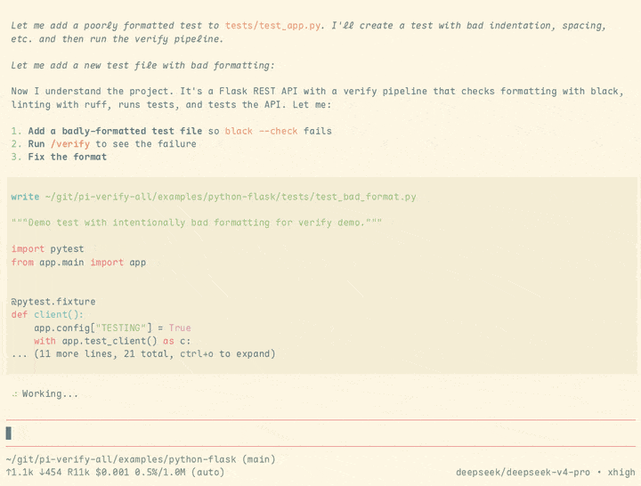

# pi-verify-all

Configurable verify pipeline extension for [pi coding agent](https://github.com/earendil-works/pi-coding-agent). Define your verification steps in a JSON file and run them with `/verify` — get a live progress widget above the editor with step-by-step status.

## Demo



## Install

```bash
pi install npm:@saburto/pi-verify-all
```

## Quick Start

Create `.pi/verify.json` in your project root:

```json
{
  "steps": [
    { "name": "Format code", "run": "mvnd spotless:apply" },
    { "name": "Unit tests", "run": "mvnd test" },
    { "name": "Build", "run": "mvnd package -DskipTests" }
  ]
}
```

Then in pi, run:

```
/verify
```

The agent can also call `run_verify` as a tool. After a failure, the pipeline auto-retries when the agent fixes the issue.

Check out [`examples/python-flask`](examples/python-flask) for a full working project with background processes, health checks, and multi-tool CI.

## Configuration

Config file is searched in order: `.pi/verify.json`, then `verify.json`.

### Top-level fields

| Field | Type | Required | Default | Description |
|-------|------|----------|---------|-------------|
| `steps` | array | ✅ | — | Array of step objects |
| `maxRetries` | number | ❌ | `5` | Max automatic retry attempts after failure |
| `onExhausted` | string | ❌ | — | Shell command to run when all retries fail (e.g. Slack notification) |

### Step fields

| Field | Type | Required | Default | Description |
|-------|------|----------|---------|-------------|
| `name` | string | ✅ | — | Display name in the widget |
| `run` | string | ✅ | — | Shell command to execute |
| `cwd` | string | ❌ | project root | Working directory (relative to project root) |
| `env` | object | ❌ | `{}` | Extra environment variables |
| `timeout` | number | ❌ | none | Timeout in seconds |
| `condition` | string | ❌ | — | Shell command; step is **skipped** if it exits non-zero |
| `continueOnFail` | boolean | ❌ | `false` | Don't stop the pipeline on failure |
| `background` | boolean | ❌ | `false` | Start as a background process (killed when pipeline ends) |
| `healthCheck` | string | ❌ | — | URL to poll until HTTP 200 (for background processes) |
| `healthTimeout` | number | ❌ | `60` | Max seconds to wait for health check |

### Example: full pipeline

```json
{
  "steps": [
    {
      "name": "Format code",
      "run": "mvnd spotless:apply -Dgit.commit.id.skip=true"
    },
    {
      "name": "SonarQube analysis",
      "run": "make sonar"
    },
    {
      "name": "Stop existing app",
      "run": "lsof -ti:8080 | xargs kill 2>/dev/null || true"
    },
    {
      "name": "Start application",
      "run": "mvnd spring-boot:run -Dspring-boot.run.arguments=\"--server.port=8080\"",
      "background": true,
      "healthCheck": "http://localhost:8080/actuator/health",
      "healthTimeout": 120
    },
    {
      "name": "E2E tests",
      "run": "make hurl"
    },
    {
      "name": "Acceptance tests",
      "run": "make acceptance-test"
    },
    {
      "name": "Quality gate",
      "run": "make verify-sonar-gate",
      "continueOnFail": true
    }
  ]
}
```

### Example: conditional steps

```json
{
  "steps": [
    {
      "name": "Install deps",
      "run": "npm ci",
      "condition": "[ -f package.json ]"
    },
    {
      "name": "Typecheck",
      "run": "npx tsc --noEmit",
      "condition": "[ -f tsconfig.json ]"
    },
    {
      "name": "Tests",
      "run": "npm test"
    }
  ]
}
```

### Example: env vars & custom cwd

```json
{
  "steps": [
    {
      "name": "Build frontend",
      "run": "npm run build",
      "cwd": "frontend",
      "env": { "NODE_ENV": "production" }
    },
    {
      "name": "Build backend",
      "run": "mvn package",
      "cwd": "backend"
    }
  ]
}
```

## Commands

| Command | Description |
|---------|-------------|
| `/verify` | Run the verify pipeline and show live progress |
| `/verify-stop` | Cancel the running pipeline |

## Tools

The agent can call `run_verify` to trigger the pipeline programmatically.

## Auto-retry

When a step fails, the extension watches for `agent_end`. After the agent finishes its turn (presumably fixing the issue), the pipeline re-runs automatically — up to `maxRetries` attempts (default 5). If it keeps failing, the extension gives up, runs `onExhausted` (if configured), and notifies you.

### Example: with retry config and onExhausted

```json
{
  "maxRetries": 3,
  "onExhausted": "curl -X POST -H 'Content-Type: application/json' -d '{\"text\":\"Verify pipeline exhausted retries!\"}' https://hooks.slack.com/services/T.../B.../...",
  "steps": [
    { "name": "TypeScript check", "run": "npx tsc --noEmit" },
    { "name": "Unit tests", "run": "npx vitest run" }
  ]
}
```

## Logs

Each run writes a full log to a temp directory (`/tmp/verify-*/pipeline.log`). The log path is shown in the widget and in failure messages.

## License

MIT
